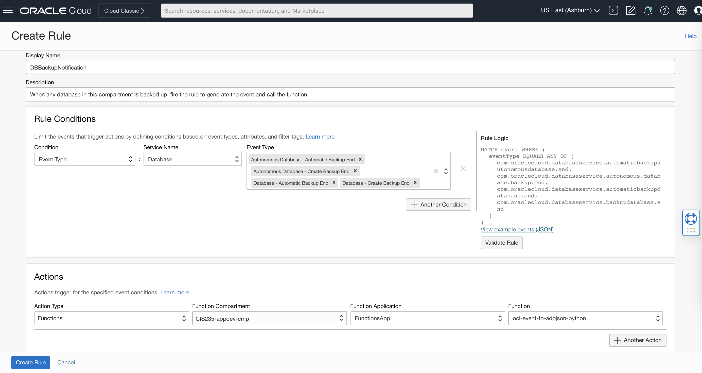

# Functions-Based Event Processing

Builds off sample code to create a function to take any cloud event and send it to ADB JSON database.  The insert is using a Python Oracle driver to insert a JSON object (row) to a collection (table).  It is using the SODA drivers, with configuration provided by the OCI Function.  

SODA allows database activity entirely using JSON, and the events come in from OCI's Event system, using Rules to deliver selected events to this function.  The Events are based on CloudEvents, a JSON formatted document containing the details.

This function does not cover or care what happens with the event after it is processed.  There is no concept of store and forward, but there could be if required.

## Function Details

There are 3 things in this repository:

- Sample code from [OCI Functions Samples](https://github.com/oracle-samples/oracle-functions-samples/tree/master/samples)
- Function *oci-event-to-adbjson* - takes arbitrary JSON and writes to configured ADB JSON database
- Python script *oci-generate-cloudevent* - generates a cloud event and calls above function

The last one above could be turned into a function, fronted with an API Gateway, and made to generate events using unauthenticated HTTPS calls.

The main function here requires 5 configuration parameters:

- PYTHON_USERNAME - Database username
- PYTHON_PASSWORD - Database password (future enhancement to pull from Vault)
- PYTHON_CONNECTSTRING - Database connection string, defined by ADB
- DEBUG - boolean flag, whether to output logging info verbosely
- EVENT_COLLECTION - Name of DB Collection (table) to insert into.

## Database Setup

This function should run against any database at 19c or higher that has support for JSON tables and allows the SODA Drivers to work.  For testing, an ADB-JSON database was created on OCI, accessible from the VCN/subnet that the function lives in.   The user "DASH" was created with roles CONNECT,RESOURCE,SODA_APP and unlimited tablespace privilege.

### SODA Drivers and OracleDB Thick

From the Tools menu on the ADB instance, the SODA Drivers page explains using the thick driver to access SODA.  Therefore the function was built with a modified Docker file, which adds the oracle client packages.  Once deployed, the thick driver is available to the function code. 

[SODA Drivers Main Page](https://www.oracle.com/database/what-is-json/technologies/database/#sodadrivers)

## Function Deployment

Once this repo is checked out, to deploy the function, the development environment must be configured for deployment.  Follow the [OCI Functions Quickstart](https://docs.oracle.com/en-us/iaas/Content/Functions/Tasks/functionsquickstartguidestop.htm) for help on this.

Listing the Functions App (once created and set up within FN Context):

```
oci-event-to-adbjson-python % fn list apps
NAME            ID
FunctionsApp    ocid1.fnapp.oc1.iad.aaaaaaaae4w4rne5p3ky4pttm4tz74wwn2d3jwk6uddp7254zcrra7b67hza
```

Deploying the function (includes Docker build, push to Container Registry, Function definition)
```
oci-event-to-adbjson-python % fn -v deploy --app FunctionsApp
Deploying oci-event-to-adbjson-python to app: FunctionsApp
Bumped to version 0.0.47
Using Container engine docker
Building image iad.ocir.io/orasenatdpltintegration01/andrew-gregory-functions/oci-event-to-adbjson-python:0.0.47 
Dockerfile content
-----------------------------------
FROM fnproject/python:3.9-dev as build-stage
WORKDIR /function
ADD requirements.txt /function/
#RUN groupadd --gid 1000 fn && \
#    adduser --uid 1000 --gid fn fn
RUN pip3 install --target /python/  --no-cache --no-cache-dir -r requirements.txt &&\
    rm -fr ~/.cache/pip /tmp* requirements.txt func.yaml Dockerfile .venv &&\
    chmod -R o+r /python
ADD . /function/
RUN rm -fr /function/.pip_cache
FROM fnproject/python:3.9
WORKDIR /function
RUN microdnf -y install oracle-release-el8
RUN microdnf -y install oracle-instantclient19.16-basiclite
COPY --from=build-stage /python /python
COPY --from=build-stage /function /function
RUN chmod -R o+r /function
ENV PYTHONPATH=/function:/python
ENTRYPOINT ["/python/bin/fdk", "/function/func.py", "handler"]
-----------------------------------
FN_REGISTRY:  iad.ocir.io/orasenatdpltintegration01/andrew-gregory-functions
Current Context:  agfunctions
[+] Building 5.1s (19/19) FINISHED                                                                                                    
 => [internal] load build definition from Dockerfile                                                                             0.0s
 => => transferring dockerfile: 37B                                                                                              0.0s
 => [internal] load .dockerignore                                                                                                0.0s
 => => transferring context: 2B                                                                                                  0.0s
 => [internal] load metadata for docker.io/fnproject/python:3.9-dev                                                              1.0s
 => [internal] load metadata for docker.io/fnproject/python:3.9                                                                  1.0s
 => [internal] load build context                                                                                                0.0s
 => => transferring context: 2.88kB                                                                                              0.0s
 => [build-stage 1/6] FROM docker.io/fnproject/python:3.9-dev@sha256:4274b49fc89191995e036a44b90b2c594d451d83b6e03c1092b7cbbe17  0.0s
 => [stage-1 1/7] FROM docker.io/fnproject/python:3.9@sha256:69d436d55b53b71f3ce4b026fec24cbdf9e2a450063b6bff8b533979981c8c67    0.0s
 => CACHED [build-stage 2/6] WORKDIR /function                                                                                   0.0s
 => CACHED [build-stage 3/6] ADD requirements.txt /function/                                                                     0.0s
 => CACHED [build-stage 4/6] RUN pip3 install --target /python/  --no-cache --no-cache-dir -r requirements.txt &&    rm -fr ~/.  0.0s
 => [build-stage 5/6] ADD . /function/                                                                                           0.1s
 => [build-stage 6/6] RUN rm -fr /function/.pip_cache                                                                            0.7s
 => CACHED [stage-1 2/7] WORKDIR /function                                                                                       0.0s
 => CACHED [stage-1 3/7] RUN microdnf -y install oracle-release-el8                                                              0.0s
 => CACHED [stage-1 4/7] RUN microdnf -y install oracle-instantclient19.16-basiclite                                             0.0s
 => CACHED [stage-1 5/7] COPY --from=build-stage /python /python                                                                 0.0s
 => [stage-1 6/7] COPY --from=build-stage /function /function                                                                    0.0s
 => [stage-1 7/7] RUN chmod -R o+r /function                                                                                     0.4s
 => exporting to image                                                                                                           0.0s
 => => exporting layers                                                                                                          0.0s
 => => writing image sha256:bd6f50dd83f76845e4034e6c881731b94c719bd938323c2852ccea5b4dddf408                                     0.0s
 => => naming to iad.ocir.io/orasenatdpltintegration01/andrew-gregory-functions/oci-event-to-adbjson-python:0.0.47               0.0s

Use 'docker scan' to run Snyk tests against images to find vulnerabilities and learn how to fix them

Parts:  [iad.ocir.io orasenatdpltintegration01 andrew-gregory-functions oci-event-to-adbjson-python:0.0.47]
Using Container engine docker to push
Pushing iad.ocir.io/orasenatdpltintegration01/andrew-gregory-functions/oci-event-to-adbjson-python:0.0.47 to docker registry...The push refers to repository [iad.ocir.io/orasenatdpltintegration01/andrew-gregory-functions/oci-event-to-adbjson-python]
2e6768add4ca: Pushed 
5ee6765ec8e2: Pushed 
a1d836d1dc27: Layer already exists 
7e68cd2bc964: Layer already exists 
42d1d7692e31: Layer already exists 
fe9da8dc0cad: Layer already exists 
1ade3e4895e1: Layer already exists 
f23c53d7aab5: Layer already exists 
cf4db719a369: Layer already exists 
0.0.47: digest: sha256:991fc45de7a8defcd462f1fa0b056dab39947275700b08c814234b9e014296d2 size: 2208
Updating function oci-event-to-adbjson-python using image iad.ocir.io/orasenatdpltintegration01/andrew-gregory-functions/oci-event-to-adbjson-python:0.0.47...
```

Listing the Deployed Function with OCID:
```
oci-event-to-adbjson-python % fn list functions FunctionsApp
NAME                            IMAGE                                                                                                ID
oci-event-to-adbjson-python     iad.ocir.io/orasenatdpltintegration01/andrew-gregory-functions/oci-event-to-adbjson-python:0.0.47    ocid1.fnfunc.oc1.iad.aaaaaaaa5szzbujwi46p3balukkd2og5zterdayq2v2ldw6ljjtu3ja2dota
```

## Invoking Manually

Given any JSON, in this case [sample_event.json](./sample_event.json), simply send that JSON to the function directly.  

```
oci-event-to-adbjson-python % cat ../sample_event.json|fn invoke FunctionsApp oci-event-to-adbjson-python
{"message": "Response: <oracledb.soda.SodaDocument object at 0x7fc797df7c70>"}
```

This simulates the event delivery, which creates an item in the JSON Collection (aka row in a table).

## Normal Invocation via Event Rules

Ecxample of rule being created.  The same function can process many different rules, which are compartment-based.  For example, production and non-production DBs may live in different compartments, and we may want notifications for different events.  See [OCI Events Listing](https://docs.oracle.com/en-us/iaas/Content/Events/Reference/eventsproducers.htm) for details on what events can be captured.  

Example rule that invokes this function.


NOTE - in the image above, you may also configure the rule to deliver email, hit a pager, or deliver an additional notification in addition to invoking the function.

## Function Logging

To see logs that the function generated, look to the Logs area of OCI, as configured at the Function Application layer.  Each function invocation will generate log messages, and the verbosity is controlled with the DEBUG config variable defined above.

[Logging Page](./FunctionLogging.png)

Messages come through as such:

[Log Message Debug](./FunctionLogMessage.png)

From the Main Function page, the console also shows metrics around invocations, duration and more.

[Metrics](./FunctionInvocationMetrics.png)
