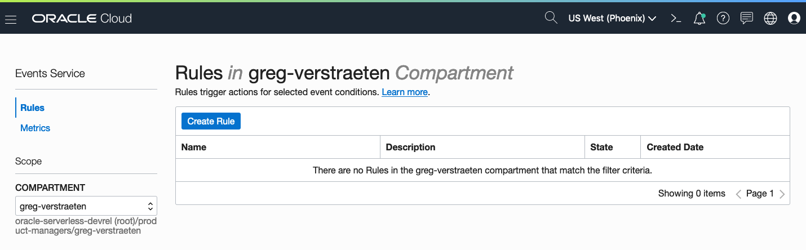
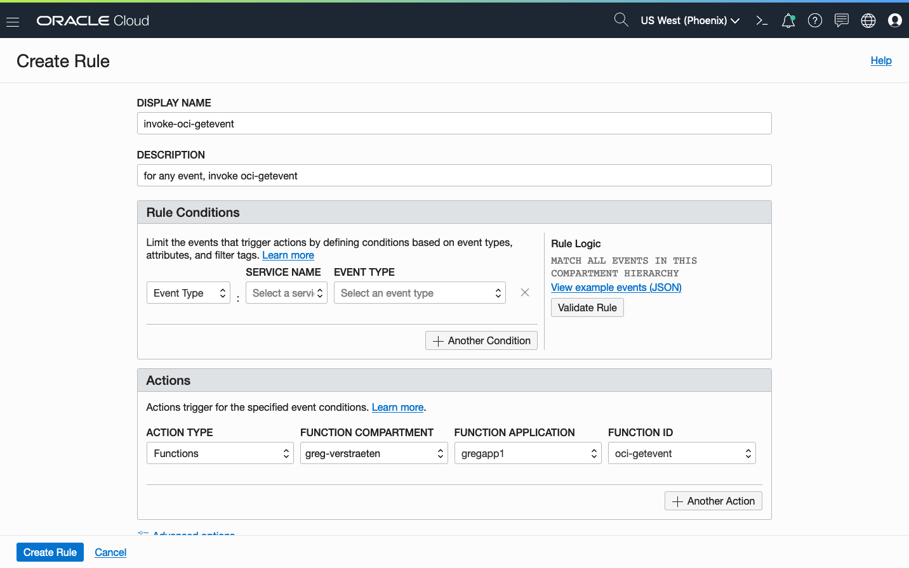

# Function that logs the details of a Cloud event

This function logs the details of a Cloud event.

As you make your way through this tutorial, look out for this icon .
Whenever you see it, it's time for you to perform an action.


## Prerequisites
Before you deploy this sample function, make sure you have run step A, B and C of the [Oracle Functions Quick Start Guide for Cloud Shell](https://www.oracle.com/webfolder/technetwork/tutorials/infographics/oci_functions_cloudshell_quickview/functions_quickview_top/functions_quickview/index.html)
* A - Set up your tenancy
* B - Create application
* C - Set up your Cloud Shell dev environment


## List Applications 
Assuming your have successfully completed the prerequisites, you should see your 
application in the list of applications.
```
fn ls apps
```


## Create or Update your Dynamic Group
In order to use other OCI Services, your function must be part of a dynamic group. For information on how to create a dynamic group, refer to the [documentation](https://docs.cloud.oracle.com/iaas/Content/Identity/Tasks/managingdynamicgroups.htm#To).

When specifying the *Matching Rules*, we suggest matching all functions in a compartment with:
```
ALL {resource.type = 'fnfunc', resource.compartment.id = 'ocid1.compartment.oc1..aaaaaxxxxx'}
```
Please check the [Accessing Other Oracle Cloud Infrastructure Resources from Running Functions](https://docs.cloud.oracle.com/en-us/iaas/Content/Functions/Tasks/functionsaccessingociresources.htm) for other *Matching Rules* options.


## Review and customize your function
Review the following files in the current folder:
* the code of the function, [func.py](./func.py)
* its dependencies, [requirements.txt](./requirements.txt)
* the function metadata, [func.yaml](./func.yaml)


## Deploy the function 
In Cloud Shell, run the *fn deploy* command to build the function and its dependencies as a Docker image, 
push the image to OCIR, and deploy the function to Oracle Functions in your application.


```
fn -v deploy --app <app-name>
```


## Create the Cloud Event rule
Create a Cloud Event rule on the console navigating to Application Integration > Event Service. Click *Create Rule*.



Assign a display name and a description, customize the Rule Conditions or leave them empty to match all events. In the *Actions* section, set the *Action type* as "Functions", select your *Function Compartment*, your *Function Application*, and your *Function ID*.



## Test
Here is the type of message generated by Events with a rule that generates *Boot Volume Backup End* events.  This rule is applied at the compartment level.

```json
e{
  "eventType" : "com.oraclecloud.blockvolumes.createbootvolumebackup.end",
  "cloudEventsVersion" : "0.1",
  "eventTypeVersion" : "2.0",
  "source" : "BlockVolumes",
  "eventTime" : "2022-09-14T18:04:52Z",
  "contentType" : "application/json",
  "data" : {
    "compartmentId" : "ocid1.compartment.oc1..aaaaaaaa56cet4engnkah7pnrtljo3h55slitvhpmln4lpsi7toeri3qoeqq",
    "compartmentName" : "CIS235-appdev-cmp",
    "resourceName" : "notifyBackup",
    "resourceId" : "ocid1.bootvolumebackup.oc1.iad.abuwcljra66d3zs6avj4iwshe2hftw2zqqqguvb7evvx5zjm6fua26vmlimq",
    "freeformTags" : { },
    "definedTags" : {
      "TagDefaults" : {
        "Created_by" : "oracleidentitycloudservice/andrew.gregory@oracle.com",
        "Created_at" : "2022-07-13T13:29:33.107Z"
      },
      "CIS235-namesp" : {
        "CreatedBy" : "oracleidentitycloudservice/andrew.gregory@oracle.com",
        "CreatedOn" : "2022-07-13T13:29:33.107Z"
      }
    },
    "additionalDetails" : {
      "sourceType" : "MANUAL",
      "volumeName" : "stuff (Boot Volume)",
      "volumeId" : "ocid1.bootvolume.oc1.iad.abuwcljrcrrwgeiuvhjd3snxr3h52ujyp773cxga5ttbxkbtpdouz5t7s23q",
      "backupState" : "AVAILABLE",
      "status" : "operationSucceed"
    }
  },
  "eventID" : "17cf38ba-4f7f-42bb-a660-a26e639b9273",
  "extensions" : {
    "compartmentId" : "ocid1.compartment.oc1..aaaaaaaa56cet4engnkah7pnrtljo3h55slitvhpmln4lpsi7toeri3qoeqq"
  }
}
```


## Monitoring Functions

Learn how to configure basic observability for your function using metrics, alarms and email alerts:
* [Basic Guidance for Monitoring your Functions](../basic-observability/functions.md)

